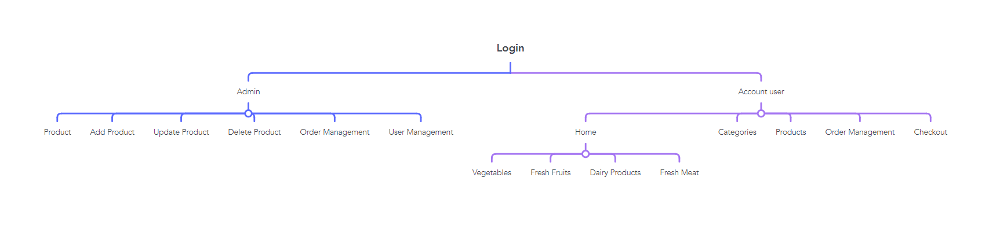

"# prj301-se1735-11" 
Name of group
HuanKhoaDat
# Purpose of the system
The purpose of an informational website is to help users find necessary information about a topic or field. Due to the special site functions, all data available on the website is easily structured and systematized, making working with it as efficient and convenient as possible.Help users find the item they want
# who use a Systerm
People who are interested in the field of food and drink
# Feature
- Log in
adimin
-Customer management
- receive recipient information
-add, delete, edit products
- see what information customers need
- update goods
User
- choose the item they want
-add to cart
-search for the item
## DESIGN 
# SItE MAP

<!--  -->
